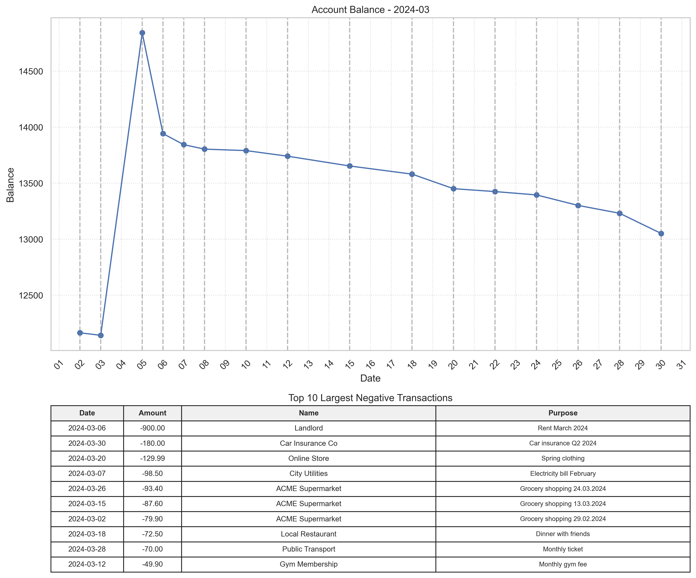
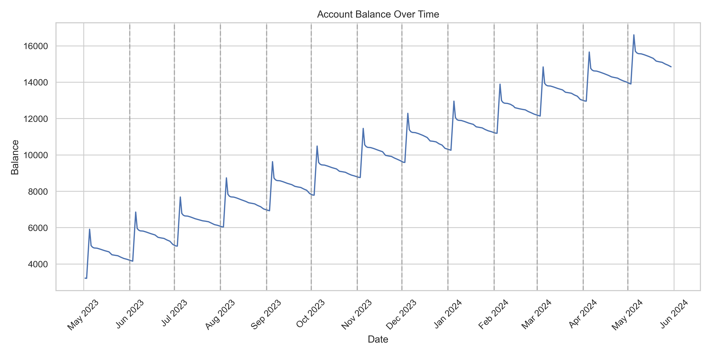

# Financial Data Analysis Project

This project performs financial data analysis on CSV files, including data processing, monthly summaries, and visualization.

## Table of Contents
- [Overview](#overview)
- [Features](#features)
- [Requirements](#requirements)
- [Installation](#installation)
- [Usage](#usage)
- [File Structure](#file-structure)
- [Contributing](#contributing)
- [License](#license)

## Overview

This Jupyter Notebook-based project is designed to analyze financial transaction data from CSV files. It provides various functionalities such as data processing, monthly summaries, and visualization of account balances and transactions.

## Features

- Data import and preprocessing from CSV files
- Monthly transaction summaries
- Account balance visualization over time
- Monthly detailed analysis with graphs and tables
- Top 10 largest negative transactions for each month
- Automated graph generation for all available months

## Screenshots

### Monthly Analysis Example


Monthly analysis view, including the account balance graph and the top 10 largest negative transactions for a specific month.

### Overall Account Balance


Account balance over time view, providing a comprehensive summary of financial trends across multiple months.

## Requirements

- Python 3.x
- Jupyter Notebook
- pandas
- matplotlib
- seaborn
- tabulate

## Installation

1. Clone this repository:
   ```
   git clone https://github.com/yourusername/financial-data-analysis.git
   cd financial-data-analysis
   ```

2. Install the required packages:
   ```
   pip install pandas matplotlib seaborn tabulate
   ```

3. Launch Jupyter Notebook:
   ```
   jupyter notebook
   ```

## Usage

1. Place your CSV file in the `private/import/` directory and name it `import.csv`.

2. Open the `Financial_Data_Analysis.ipynb` notebook in Jupyter.

3. Run the cells in order to perform the analysis.

4. The script will generate graphs and tables for each month, saving them in the `private/images/` directory.

5. You can interact with the notebook to select specific months for detailed analysis.

## File Structure

```
financial-data-analysis/
│
├── Financial_Data_Analysis.ipynb
├── README.md
├── private/
│   ├── import/
│   │   └── import.csv
│   └── images/
│       ├── balance_graph_all.png
│       └── YYYY-MM_graph.png
└── .gitignore
```

## Contributing

Contributions to this project are welcome. Please fork the repository and submit a pull request with your changes.

## License

This project is licensed under the MIT License - see the [LICENSE](LICENSE) file for details.