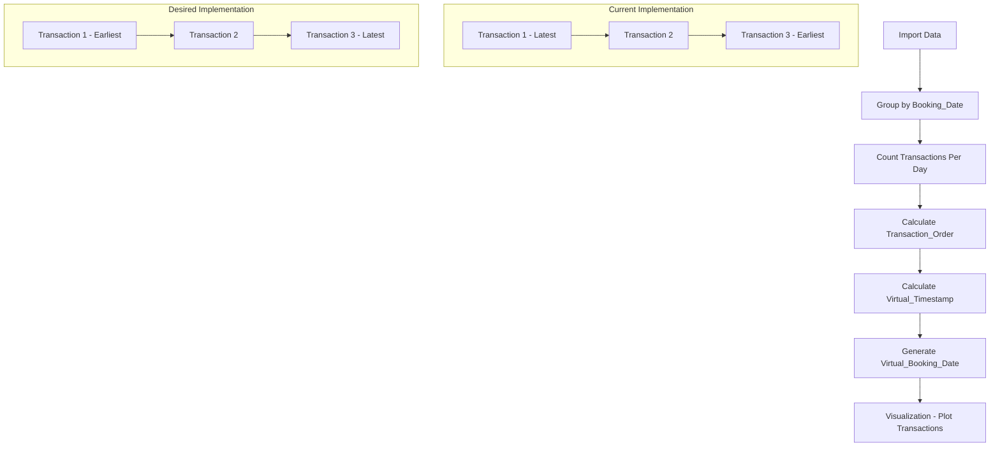

# Transaction Ordering Fix Plan

## Current Issue
Currently, transactions within the same day are displayed in reverse chronological order (newest first), but they should be shown in chronological order (oldest first).

## Analysis of Current Implementation

In `data_processing.py`, the key section handling transaction ordering is:

```python
# Calculate virtual timestamps with random offset
data['Transaction_Order'] = data.groupby('Booking_Date').cumcount()
data['Transactions_Per_Day'] = data.groupby('Booking_Date')['Booking_Date'].transform('count')
data['Virtual_Timestamp'] = data['Transaction_Order'] / data['Transactions_Per_Day']
data['Virtual_Timestamp'] = data['Virtual_Timestamp'].clip(0, 1)
data['Virtual_Booking_Date'] = data['Booking_Date'] + pd.to_timedelta(data['Virtual_Timestamp'], unit='D')
```

The `cumcount()` function numbers transactions within each day from 0 to n-1. Currently, this creates a virtual timestamp that orders transactions from most recent to oldest. The `Virtual_Booking_Date` is then used in visualization to plot the transactions.

## Proposed Solution

1. **Analyze Current Implementation**
   - The current implementation uses `groupby('Booking_Date').cumcount()` to create a Transaction_Order
   - This results in newer transactions appearing before older ones within the same day
   - The Virtual_Booking_Date field is used in visualization to position transactions on the time axis

2. **Implementation Approach**
   - Keep the original Transaction_Order calculation
   - Invert the Virtual_Timestamp calculation to reverse the order
   - This will maintain the same data structure but flip the chronological positioning of transactions

3. **Specific Code Change (SELECTED APPROACH)**
   ```python
   # Original code:
   data['Transaction_Order'] = data.groupby('Booking_Date').cumcount()
   data['Transactions_Per_Day'] = data.groupby('Booking_Date')['Booking_Date'].transform('count')
   data['Virtual_Timestamp'] = data['Transaction_Order'] / data['Transactions_Per_Day']
   
   # Modified code:
   data['Transaction_Order'] = data.groupby('Booking_Date').cumcount()
   data['Transactions_Per_Day'] = data.groupby('Booking_Date')['Booking_Date'].transform('count')
   data['Virtual_Timestamp'] = 1 - (data['Transaction_Order'] / data['Transactions_Per_Day'])
   ```

4. **How This Works**
   - Transactions are still counted from 0 to n-1 within each day
   - By subtracting the normalized position (Transaction_Order / Transactions_Per_Day) from 1, we invert the ordering
   - This simple approach maintains the same structure but reverses the chronological ordering
   - The rest of the code (clipping and Virtual_Booking_Date calculation) remains unchanged

5. **Testing Strategy**
   - Run the script with the modified code
   - Verify that transactions are displayed in chronological order
   - Check the balance graphs to ensure they still render correctly

## Visualization Impact

The change will affect how transactions are positioned along the time axis within a single day in the monthly graphs. The overall balance trend should remain accurate, but the intra-day positioning will be reversed to show the correct chronological order.

## Diagram of Transaction Ordering



## Next Steps

1. Implement the selected approach in the `data_processing.py` file
2. Test the implementation with real data
3. Verify that transactions are displayed in the correct chronological order
4. Ensure that all visualizations function correctly with the updated ordering